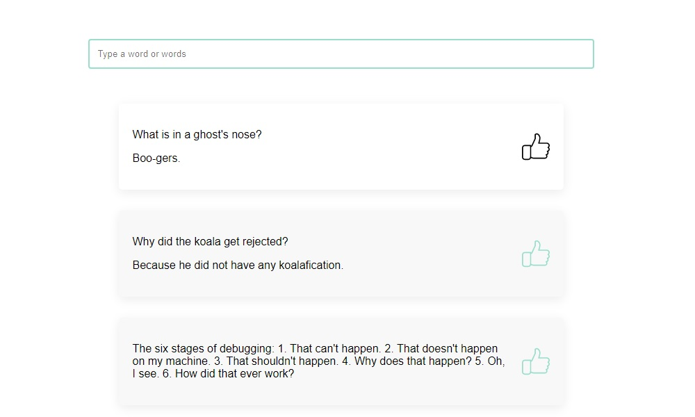

# [Приложение: список анекдотов](https://agants.github.io/jokes/)



## Функционал:
* Список из 10 анекдотов (API: https://sv443.net/jokeapi/v2/) с поиском по слову
* Возможность отметить лайком + визуализация отметки, сохранение информации
* Vue.js
* Sass


## Project setup
```
npm install
```

### Compiles and hot-reloads for development
```
npm run serve
```